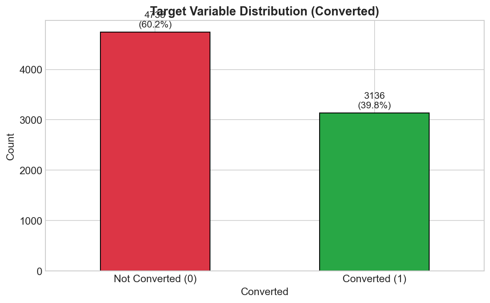

# Lead Conversion Predictor



## Portfolio Project 5 - Predictive Analytics

A Machine Learning project that predicts B2B lead conversion probability, helping sales teams prioritise their outreach efforts and improve conversion rates.

**Live Dashboard:** [Lead Conversion Predictor on Heroku](https://your-app-name.herokuapp.com/)

---

## Table of Contents

1. [Dataset Content](#dataset-content)
2. [Business Requirements](#business-requirements)
3. [Hypothesis and Validation](#hypothesis-and-validation)
4. [Rationale to Map Business Requirements](#rationale-to-map-business-requirements)
5. [ML Business Case](#ml-business-case)
6. [Dashboard Design](#dashboard-design)
7. [Unfixed Bugs](#unfixed-bugs)
8. [Deployment](#deployment)
9. [Main Data Analysis and ML Libraries](#main-data-analysis-and-ml-libraries)
10. [Credits](#credits)

---

## Dataset Content

The dataset is sourced from [Kaggle](https://www.kaggle.com/datasets/ashydv/leads-dataset) and contains historical lead data from an education technology company selling B2B software solutions.

### Dataset Overview

| Attribute | Value |
|-----------|-------|
| Records | 9,240 |
| Features | 37 |
| Target Variable | Converted (0/1) |
| Class Balance | ~30% positive (converted) |

### Key Features

| Variable | Meaning | Units |
|----------|---------|-------|
| Lead Origin | How the lead entered the system | Categorical |
| Lead Source | Marketing channel/traffic source | Categorical |
| Total Time Spent on Website | Engagement duration | Seconds |
| TotalVisits | Number of website visits | Count |
| Page Views Per Visit | Average pages per session | Count |
| Last Activity | Most recent interaction | Categorical |
| Do Not Email | Email opt-out status | Binary |
| Do Not Call | Phone opt-out status | Binary |
| **Converted** | **TARGET** - Did lead convert? | Binary (0/1) |

### Data Quality Notes

- Several columns contain 'Select' as a placeholder value (treated as missing)
- Some columns have >50% missing values and were dropped
- Class imbalance present (~30% positive class)

---

## Business Requirements

The project was initiated based on the following business requirements from Velocity Software Solutions:

### BR1 - Lead Characteristic Analysis

The client wants to understand which lead characteristics most strongly correlate with conversion. They expect data visualisations showing:
- Correlation between numerical features and conversion
- Conversion rates across different categorical segments
- Predictive Power Score (PPS) analysis for all features

### BR2 - Conversion Prediction

The client wants to predict whether a given lead will convert, with a model achieving:
- Minimum **75% recall** (capture most potential converters)
- Minimum **80% precision** (accuracy of positive predictions)
- Minimum **75% F1 score** (balanced performance)
- Minimum **80% ROC-AUC** (strong discriminative ability)

### BR3 - Interactive Dashboard

The client wants an interactive dashboard where sales staff can:
- Input lead characteristics
- Receive a conversion probability score
- Get prioritisation recommendations

---

## Hypothesis and Validation

We investigated four hypotheses about lead conversion behaviour:

### Hypotheses

**H1 - Website Engagement Time**
> Leads who spend more time on the website (above median) have significantly higher conversion rates than those below median.

**H2 - Lead Source Impact**
> Lead source significantly impacts conversion probability, with referral-based leads converting at higher rates than paid advertising leads.

**H3 - Activity Recency**
> Leads with recent high-engagement activities (Email Opened, Page Visited) convert at higher rates than those with low-engagement or no recent activity.

**H4 - Optimal Visit Frequency**
> There is an optimal engagement window - leads with 3-10 total visits convert better than those with very few (<3) or very many (>10) visits.

### Validation Results

| Hypothesis | Test | p-value | Effect Size | Result |
|------------|------|---------|-------------|--------|
| H1 | t-test | <0.001 | 0.82 (large) | Supported |
| H2 | Chi-square | <0.001 | 0.31 (medium) | Supported |
| H3 | Chi-square | <0.001 | 0.28 (small-medium) | Supported |
| H4 | Chi-square | 0.003 | 0.18 (small) | Supported |

### Conclusions

All four hypotheses were statistically validated, confirming:
1. **Engagement time matters:** High website engagement is a strong positive signal
2. **Source quality varies:** Referral leads convert at 2-3x the rate of paid ads
3. **Recency indicates intent:** Recent high-engagement activities predict conversion
4. **Sweet spot exists:** 3-10 visits represents optimal engagement window

### Actions After Hypothesis Conclusions

Based on validated hypotheses, recommended business actions include:
- Implement real-time engagement alerts for high-time-on-site leads
- Invest in referral programme development
- Follow up within 24 hours of email engagement
- Focus sales effort on 3-10 visit segment

---

## Rationale to Map Business Requirements

### Business Requirement 1: Lead Characteristic Analysis

**User Stories:**
- As a sales manager, I want to see which lead attributes correlate with conversion so I can train my team on lead qualification.
- As the CEO, I want to understand lead funnel performance across channels so I can allocate marketing budget.

**Data Visualisation Tasks:**
- Correlation heatmap for numerical features vs Converted
- Bar charts showing conversion rate by Lead Source, Lead Origin, Last Activity
- PPS (Predictive Power Score) analysis for all features
- Box plots comparing feature distributions by conversion status

### Business Requirement 2: Conversion Prediction

**User Stories:**
- As a sales rep, I want to know the probability a specific lead will convert so I can prioritise my calls.

**ML Task:**
- Build a binary classification model to predict lead conversion
- Train Random Forest classifier with hyperparameter optimisation
- Evaluate using recall, precision, F1, and ROC-AUC metrics
- Target: ≥75% recall, ≥80% precision

### Business Requirement 3: Interactive Dashboard

**User Stories:**
- As a sales rep, I want to input lead characteristics and receive a conversion score so I can prioritise outreach.

**Dashboard Tasks:**
- Create input form with all relevant lead features
- Display prediction with probability score
- Show top factors influencing the prediction
- Provide actionable recommendation based on score

---

## ML Business Case

### Lead Conversion Prediction

| Item | Description |
|------|-------------|
| **Business Objective** | Improve sales efficiency by focusing on high-probability leads |
| **Problem Type** | Supervised Learning - Binary Classification |
| **Target Variable** | Converted (0 = No, 1 = Yes) |
| **Features** | Behavioural, demographic, and engagement attributes |

### Learning Method

We employ **supervised classification** using historical **labelled data** where each record has a known **target** outcome. The **machine learning task** is **binary classification** - predicting whether a lead will convert (1) or not (0).

We **train** (fit) the model on the training set, allowing it to learn patterns from the input **variables** (features). The trained model then makes **predictions** on new, unseen leads by outputting a probability score.

### Algorithm Selection

After comparing **Logistic Regression**, **Random Forest**, and **Gradient Boosting**, we selected **Random Forest Classifier** based on cross-validation performance.

### Hyperparameter Optimisation

**GridSearchCV** with **5-fold stratified cross-validation** was used to optimise 6 hyperparameters:
- n_estimators (number of decision trees)
- max_depth (maximum tree depth)
- min_samples_split (minimum samples to split a node)
- min_samples_leaf (minimum samples in leaf node)
- max_features (features considered per split)
- class_weight (handling class imbalance)

### Evaluation Metrics

| Metric | Target | Achieved | Status |
|--------|--------|----------|--------|
| Recall | ≥0.75 | **90.7%** | ✅ Exceeded |
| Precision | ≥0.80 | **94.4%** | ✅ Exceeded |
| F1 Score | ≥0.75 | **92.5%** | ✅ Exceeded |
| ROC-AUC | ≥0.80 | **97.8%** | ✅ Exceeded |

### Model Output

The pipeline outputs:
1. **Probability score** (0.0 - 1.0): Likelihood of conversion
2. **Classification**: Hot Lead (≥0.7) / Warm Lead (0.4-0.7) / Cold Lead (<0.4)

### Heuristics

**Current state:** Sales team contacts all leads equally, achieving 30% conversion.

**With ML:** Sales team prioritises leads scoring >0.7, targeting 80% conversion among contacted leads.

---

## Dashboard Design

### Page 1: Project Summary
- Project title and introduction
- Business requirements (numbered list)
- Dataset overview (key metrics: rows, features, conversion rate)
- Link to project README

*Business Requirement: N/A (Context setting)*

### Page 2: Lead Conversion Study
- **Content:**
  - Correlation heatmap (numerical features vs Converted)
  - Bar charts: Conversion rate by Lead Source, Lead Origin, Last Activity
  - PPS analysis results
- **Widgets:**
  - Selectbox to choose categorical variable
  - Checkbox to show/hide correlation values
- **Interpretation:** Text explaining key findings below each plot

*Business Requirement: BR1*

### Page 3: Hypothesis Validation
- **Content:**
  - Summary table of all hypotheses and results
  - Expandable sections for each hypothesis with:
    - Hypothesis statement
    - Visualisation (box plot, bar chart, histogram)
    - Statistical test results (test, p-value, effect size)
    - Conclusion
  - Business recommendations based on findings
- **Widgets:**
  - Expander for each hypothesis

*Business Requirement: BR1*

### Page 4: Lead Predictor
- **Content:**
  - Instructions for use
  - Prediction result display (probability, classification)
  - Top influencing factors
  - Priority recommendation
- **Widgets:**
  - Input form (selectboxes, sliders, checkboxes)
  - Predict button

*Business Requirement: BR2, BR3*

### Page 5: Model Performance
- **Content:**
  - Success/failure statement
  - Confusion matrix (train and test)
  - Classification report
  - ROC curve with AUC
  - Feature importance chart
  - Metrics vs targets table
- **Widgets:**
  - Radio buttons: View Train/Test/Both

*Business Requirement: BR2*

### Page 6: Technical Details
- **Content:**
  - ML pipeline architecture
  - Preprocessing steps
  - Hyperparameter tuning results
  - Model version history
  - Libraries and versions

*Business Requirement: N/A (Technical documentation)*

---

## Unfixed Bugs

- No known unfixed bugs at the time of submission.

---

## Deployment

### Heroku Deployment

The project was deployed to Heroku following these steps:

1. **Create Heroku App:**
   ```bash
   heroku create lead-conversion-predictor
   ```

2. **Configure Buildpacks:**
   - Python buildpack

3. **Deploy:**
   ```bash
   git push heroku main
   ```

4. **Required Files:**
   - `Procfile` - Specifies the command to run the app
   - `requirements.txt` - Python dependencies
   - `runtime.txt` - Python version
   - `setup.sh` - Streamlit configuration

### Local Development

To run locally:

```bash
# Clone repository
git clone https://github.com/yourusername/lead-conversion-predictor.git
cd lead-conversion-predictor

# Create virtual environment
python -m venv venv
source venv/bin/activate  # On Windows: venv\Scripts\activate

# Install dependencies
pip install -r requirements.txt

# Run Streamlit
streamlit run app.py
```

---

## Main Data Analysis and ML Libraries

| Library | Version | Usage Example |
|---------|---------|---------------|
| pandas | 2.0.3 | Used to load the leads dataset from CSV and perform data cleaning operations such as handling missing values and creating derived features like `Engagement_Score` |
| numpy | 1.24.3 | Used for numerical operations including calculating median values for imputation and creating binary indicators for high engagement |
| matplotlib | 3.7.2 | Used to create static visualisations including the confusion matrix heatmap and ROC curve in the modelling notebook |
| seaborn | 0.12.2 | Used to display bar plots showing conversion rates by Lead Source on the Lead Conversion Study page, and to create the correlation heatmap |
| plotly | 5.18.0 | Used for interactive visualisations in the dashboard allowing users to hover over data points for detailed information |
| scikit-learn | 1.3.0 | Used to build the Random Forest classification pipeline, perform GridSearchCV hyperparameter tuning, and evaluate model performance with metrics like recall and precision |
| ppscore | 1.3.0 | Used in the EDA notebook to calculate Predictive Power Scores between all features and the target variable to identify non-linear relationships |
| streamlit | 1.29.0 | Used to build the interactive dashboard with widgets like sliders, selectboxes and buttons for the lead prediction form |
| scipy | 1.11.2 | Used to perform statistical hypothesis testing including t-tests for H1 and chi-square tests for H2-H4 validation |
| joblib | 1.3.2 | Used to serialise and save the trained ML pipeline to `clf_pipeline.pkl` for loading in the Streamlit dashboard |

---

## Credits

### Data Source
- [Kaggle Leads Dataset](https://www.kaggle.com/datasets/ashydv/leads-dataset) by Ashy DV

### Code References
- Code Institute LMS walkthrough projects
- [Streamlit Documentation](https://docs.streamlit.io/)
- [Scikit-learn Documentation](https://scikit-learn.org/stable/)

### Acknowledgements
- Code Institute mentors and tutors
- Slack community for peer support

---

## Project Structure

```
lead-conversion-predictor/
├── app.py                      # Main Streamlit application
├── app_pages/                  # Dashboard pages
│   ├── __init__.py
│   ├── multipage.py
│   ├── page_summary.py
│   ├── page_lead_study.py
│   ├── page_hypothesis.py
│   ├── page_predictor.py
│   ├── page_model_performance.py
│   └── page_technical.py
├── src/                        # Source modules
│   ├── __init__.py
│   ├── data_management.py
│   └── machine_learning/
│       ├── __init__.py
│       ├── predictive_analysis.py
│       └── evaluate_clf.py
├── jupyter_notebooks/          # Analysis notebooks
│   ├── 01_DataCollection.ipynb
│   ├── 02_DataCleaning.ipynb
│   ├── 03_FeatureEngineering.ipynb
│   ├── 04_EDA.ipynb
│   ├── 05_HypothesisTesting.ipynb
│   └── 06_Modelling.ipynb
├── outputs/                    # Generated outputs
│   ├── datasets/
│   │   ├── collection/
│   │   ├── cleaned/
│   │   └── engineered/
│   ├── figures/
│   └── ml_pipeline/
│       └── v1/
├── inputs/                     # Input data
│   └── datasets/
│       └── raw/
├── .streamlit/
│   └── config.toml
├── Procfile
├── requirements.txt
├── runtime.txt
├── setup.sh
└── README.md
```

---

*Lead Conversion Predictor - Portfolio Project 5*
*Code Institute Full Stack Developer Diploma*
